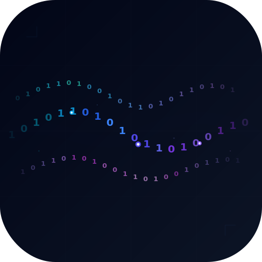

<p align="center">
  
</p>

# 河流算法 — AI 对话历史特别篇

[English](README.md) | [日本語](README_ja.md)


[](https://x.com/JKRiverse)
[](https://discord.gg/ZnmFrPvXym)
[](https://wangjiake.github.io/riverse-docs/zh/)

---

**河流算法（River Algorithm）** 是一套关于本地 AI 个人数字画像权重的算法。

现有的 AI 记忆（ChatGPT Memory、Claude Memory 等）本质上是一个**平面列表**：存几条事实，没有时间维度，没有置信度，没有矛盾检测，记忆存在云端、归平台所有，换一个平台一切归零。河流算法完全不同 — 对话像河水一样流过，关键信息像泥沙一样沉淀为画像，经过多轮验证逐步从"猜测"升级为"确认"再到"稳固"，离线整合（Sleep）则是河流的自我净化：冲走过时的信息，解决矛盾，让认知越来越清晰。所有数据存在本地，归你所有，跨平台聚合，不会因为换了一个 AI 就丢失。河流算法是成长性的：对话越多，本地积累的数据越丰富，AI 对你的理解就越深，越用越懂你。

本项目是河流算法的**特别篇**，专注于从你的 **ChatGPT / Claude / Gemini** 历史对话中批量提取个人画像 — 性格、偏好、经历、人际关系、生活轨迹。你和 AI 聊过的每一句话都是真实的你，这些数据是无价的：过去的对话记录着过去的你，而过去是事实，未来会基于现在。

与 [Riverse](https://github.com/wangjiake/JKRiver) 主项目共享同一个数据库。先用本项目填充历史画像，再用 Riverse 开始实时对话 — 你的 AI 从第一天起就认识你。

> **注意：** 目前没有任何 LLM 是专门为个人画像提取训练或微调的，因此不同模型的提取结果会存在差异，偶尔出现"幻觉"在所难免。同时，由于历史对话并非通过河流算法的对话篇产生，缺少实时的上下文感知与多轮验证，**历史画像仅供参考**，准确性不及 Riverse 实时对话中积累的画像。发现不准确的内容可以直接在网页中关闭或拒绝，不影响其他数据。也欢迎提交 [Issue](../../issues)，我会持续改进提取质量。

> **费用提醒：** 使用远端 LLM API（OpenAI、Anthropic 等）时，包含大量代码或超长消息的对话会消耗大量 token。建议运行前清理导出数据中不必要的内容。本地模型（Ollama）无费用。

### 功能

- 将你从 ChatGPT / Claude / Gemini 导出的本地对话记录导入数据库
- LLM 驱动的画像提取（支持远端 LLM API 或本地 Ollama）
- 矛盾检测与时间线追踪
- 月度快照查看
- 人际关系图谱
- 本地网页查看（中/英/日三语）

### Docker 快速体验

不想装 Python 和 PostgreSQL？**[用 Docker 即可体验](https://github.com/wangjiake/Riverse-Docker)** — 自带演示数据，支持 OpenAI / DeepSeek / Groq。

---

### 前置要求

- Python 3.11 或 3.12
- PostgreSQL
- LLM API Key（如 OpenAI、Anthropic 等）或本地 Ollama

### 快速开始（从源码）

```bash
# 1. 克隆仓库
git clone https://github.com/wangjiake/RiverHistory.git
cd RiverHistory

# 2. 创建虚拟环境并安装依赖
python3 -m venv .venv
source .venv/bin/activate        # macOS / Linux
# .venv\Scripts\activate         # Windows

pip install -r requirements.txt

# 3. 配置
# 编辑 settings.yaml：
#   - database.user: 改为你的 PostgreSQL 用户名
#     macOS Homebrew 通常是系统用户名（终端执行 whoami 查看）
#     Linux/Windows 通常是 postgres
#   - openai.api_key: 填入你的 API Key（使用本地 Ollama 则改 llm_provider 为 "local"）

# 4. 初始化数据库
# 此命令会创建两个项目（本项目和 Riverse 主项目）所需的全部表。
# 如果你已经运行过 Riverse 的 schema.sql，可以跳过此步骤。
python setup_db.py --db Riverse

# 5. 导入对话数据
# 将导出文件放到 data/ 目录下（详见 data/README.md）
python import_data.py --chatgpt data/ChatGPT/conversations.json
python import_data.py --claude data/Claude/conversations.json
python import_data.py --gemini "data/Gemini/我的活动记录.html"
# 注意：Gemini 导出文件名因语言而异，请根据实际文件名修改命令

# 6. 运行画像提取
#    格式: python run.py <源> <数量>
#    源:   chatgpt / claude / gemini / all
#    数量: 数字 = 从最早开始处理 N 条, max = 处理全部
#    所有命令都按对话时间从旧到新的顺序处理

python run.py chatgpt 50       # 只处理 ChatGPT，从最早的开始，处理 50 条
python run.py claude max       # 只处理 Claude，全部处理
python run.py gemini 100       # 只处理 Gemini，从最早的开始，处理 100 条
python run.py all max           # 三个源的数据混在一起，按时间从旧到新，全部处理（不含 demo）

# 7. 查看结果
python web.py --db Riverse
# 打开浏览器访问 http://localhost:2345
```

> **注意：** 每次运行 `run.py` 会自动清空所有画像表再重新写入，源数据表不受影响。可以放心重复运行。

### 没有对话数据？用 Demo 快速体验

项目自带测试数据，无需导出自己的 AI 对话即可体验完整流程：

| 数据集 | 人物 | 语言 | 对话数 | 命令 |
|--------|------|------|--------|------|
| `--demo` | 林雨桐 | 中文 | 50 组 | `python import_data.py --demo` |
| `--demo2` | 林雨桐（扩展） | 中文 | 50 组 | `python import_data.py --demo2` |
| `--demo3` | Jake Morrison | English | 20 组 | `python import_data.py --demo3` |

> `--demo2` 和 `--demo3` 会先清空 demo 表再导入。

```bash
python setup_db.py                  # 建库建表
python import_data.py --demo        # 导入测试数据（或 --demo2 / --demo3）
python run.py demo max              # 处理全部测试对话
python web.py --db Riverse        # 查看画像结果
```

### 清空画像数据

清空所有处理和画像表，保留已导入的源数据（chatgpt/claude/gemini/demo 表不受影响）：

```bash
python reset_db.py                  # 清空画像，保留源数据
python reset_db.py --db mydb        # 指定数据库
```

### 对话导出方式

| 平台 | 步骤 |
|------|------|
| ChatGPT | Settings → Data controls → Export data → 解压得到 `conversations.json` |
| Claude | Settings → Account → Export Data → 解压得到 `conversations.json` |
| Gemini | [Google Takeout](https://takeout.google.com/) → 选择 Gemini Apps → 解压，将 `Gemini Apps` 文件夹放入 `data/` |

### LLM 配置

**OpenAI API（推荐）：** 在 `settings.yaml` 中设置 `llm_provider: "openai"` 并填入 API Key。

**本地 Ollama：** 安装 [Ollama](https://ollama.ai)，拉取模型 `ollama pull qwen2.5:14b`，设置 `llm_provider: "local"`。

**提示词语言：** 在 `settings.yaml` 中设置 `language` 字段，支持 `"zh"`（中文）、`"en"`（English）、`"ja"`（日本語）。该设置控制 LLM 提示词的语言，不影响网页界面。

### 项目结构

```
├── settings.yaml          # LLM 和数据库配置
├── setup_db.py          # 初始化数据库和表结构
├── import_data.py       # 导入对话导出文件到数据库
├── run.py               # 运行画像提取（感知 + 睡眠整合）
├── web.py               # 本地网页查看（Flask，端口 2345）
├── reset_db.py          # 清空画像表，保留源数据
├── requirements.txt     # Python 依赖
├── data/                # 对话导出文件（已 git-ignore）
│   ├── demo.json        # 测试数据：林雨桐（中文，50 组）
│   ├── demo2.json       # 测试数据：林雨桐扩展（中文，50 组）
│   └── demo3.json       # 测试数据：Jake Morrison（英文，20 组）
├── agent/
│   ├── perceive.py      # 感知模块 — 分类用户输入
│   ├── config/          # 配置加载
│   ├── storage/         # 数据库操作
│   ├── utils/           # LLM 客户端
│   └── core/            # 核心画像提取
│       ├── sleep.py     # 主提取流程
│       └── sleep_prompts.py  # 多语言提示词（zh/en/ja）
└── templates/
    └── profile.html     # 网页模板
```

---

## 许可证

| 许可证 | 用途 |
|--------|------|
| **AGPL-3.0** | 开源使用，修改后必须开源 |
| **商业许可** | 联系：mailwangjk@gmail.com |

## 联系方式

- **X (Twitter):** [@JKRiverse](https://x.com/JKRiverse)
- **Discord:** [加入](https://discord.gg/ZnmFrPvXym)
- **Email:** mailwangjk@gmail.com
